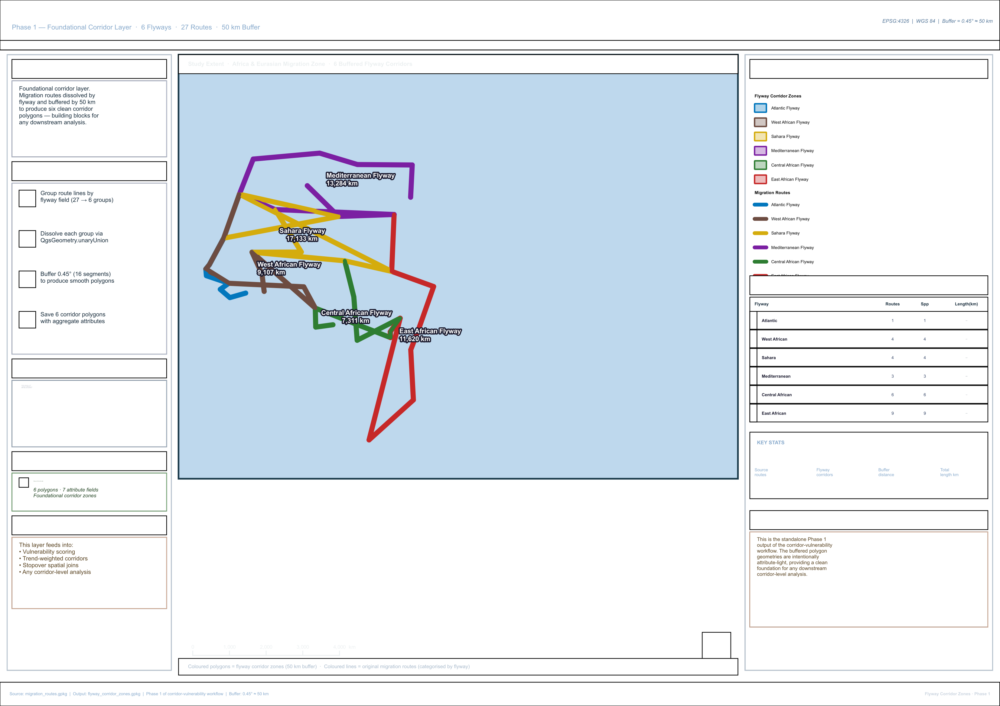

# African Bird Migration — Flyway Corridor Zones (Phase 1)

> **A foundational spatial layer** that dissolves migration route lines by
> their flyway field and buffers them by 50 km, producing six clean corridor
> polygons. Designed as a reusable building block for any downstream
> corridor-level analysis.

---

## Project Overview

| Property | Value |
|---|---|
| **Project file** | `African_Bird_Flyway_Corridor_Zones.qgz` |
| **CRS** | EPSG:4326 — WGS 84 |
| **Source features** | 27 migration route lines |
| **Output features** | 6 flyway corridor polygons |
| **Buffer distance** | 0.45° (~50 km at equator) |
| **Buffer segments** | 16 per quadrant (smooth edges) |

This is **Phase 1** of the broader corridor-vulnerability workflow,
delivered as a standalone foundational layer. The output polygons are
attribute-light by design — they carry only the geometry and basic
flyway-level descriptors needed to plug into any downstream analysis.

## Folder Structure

```
African_Bird_Flyway_Corridor_Zones/
├── African_Bird_Flyway_Corridor_Zones.qgz   (33.4 KB)
├── README.md
├── Input_layers/
│   └── migration_routes.gpkg               (104 KB · 27 lines)
└── Output_layer/
    ├── flyway_corridor_zones.gpkg          (144 KB · 6 polygons)
    └── reference_layout.png                (481 KB · 200 dpi · A3)
```

## Methodology

### Phase 1 — Foundational Corridor Construction

```
1. Group the 27 route lines by their flyway field → 6 groups
2. Dissolve each group via QgsGeometry.unaryUnion()
3. Buffer each merged geometry by 0.45 degrees with 16 segments
4. Save 6 corridor polygons to GeoPackage with attribute summary
```

### Output Attribute Schema

| Field | Type | Description |
|---|---|---|
| `flyway` | String | Flyway name |
| `n_routes` | Integer | Source route lines dissolved into this corridor |
| `n_species` | Integer | Distinct species using this flyway |
| `length_km` | Real | Total dissolved-route length (km, approx) |
| `area_deg2` | Real | Buffer polygon area (square degrees) |
| `buffer_km` | Real | Nominal buffer distance (50 km) |
| `species_list` | String | Comma-separated species using this flyway |

## Results

All 6 flyway corridors with their aggregate metrics:

| Flyway | Routes | Species | Length (km) | Area (deg²) |
|---|---|---|---|---|
| Atlantic Flyway | 1 | 1 | 2,874 | 23.66 |
| West African Flyway | 4 | 4 | 9,107 | 70.76 |
| Sahara Flyway | 4 | 4 | 17,133 | 128.40 |
| Mediterranean Flyway | 3 | 3 | 13,284 | 102.10 |
| Central African Flyway | 6 | 6 | 7,311 | 56.97 |
| East African Flyway | 9 | 9 | 11,620 | 93.59 |

### Key Observations

- **East African Flyway** has the most routes (9) and species (9) — the
  busiest corridor in the dataset.
- **Sahara Flyway** is the longest in raw kilometres (17,133 km dissolved
  length) — driven by the long north-south spans of its 4 routes.
- **Atlantic Flyway** is a single-route corridor (Osprey only) — the smallest
  and most isolated zone.

## Symbology

Categorised by flyway with matching colours across both layers:

| Flyway | Colour |
|---|---|
| Atlantic | `#0277bd` Blue |
| West African | `#6d4c41` Brown |
| Sahara | `#d4ac0d` Amber |
| Mediterranean | `#7b1fa2` Purple |
| Central African | `#2e7d32` Green |
| East African | `#c62828` Red |

Polygons are filled at 80/255 alpha (semi-transparent) so route lines
on top remain visible. Polygon labels show flyway name + dissolved
length in km.

## How to Reproduce

### PyQGIS Pseudocode

```python
from collections import defaultdict
from qgis.core import QgsGeometry

BUFFER_DEG = 0.45  # ~50 km at equator

# Group route geoms by flyway
flyway_geoms = defaultdict(list)
for f in routes_layer.getFeatures():
    flyway_geoms[f['flyway']].append(f.geometry())

# Dissolve and buffer
for fw, geoms in flyway_geoms.items():
    merged   = QgsGeometry.unaryUnion(geoms)
    buffered = merged.buffer(BUFFER_DEG, 16)
    # ... add to output polygon layer with flyway attribute
```

### Critical Replication Notes

- **Dissolve before buffering** — buffering first then merging produces
  small artefacts where individual route buffers fail to fuse cleanly
  along narrow gaps.
- **Use 16 segments per quadrant** for smooth visual edges. Fewer segments
  give the polygon a faceted appearance at zoom levels above 1:5,000,000.
- **0.45° approximates 50 km at the equator only.** At African latitudes
  this varies from about 49 km (equator) to 54 km (35°N/S). For exact
  metric distances reproject to a metric CRS first.

## Reference Map

`Output_layer/reference_layout.png` — 481 KB, 200 dpi, A3 Landscape, 113 layout items

**Left panel:** Project overview · 4-step methodology · Buffer details ·
Output layer description · Usage notes (downstream applications)

**Centre map:** Full Africa-Eurasia extent · 6 colour-coded corridor
polygons under categorised route lines · Scale bar · North arrow

**Right panel:** Auto-generated legend · 6-row corridor table with
colour bars · 4-metric stats summary

## Downstream Applications

This layer is the geometric foundation for several other analyses in the
African Bird Migration project family:

- **Vulnerability scoring** — joins stopover, threatened-species and
  duration aggregates into these polygons → composite VI per corridor
- **Trend-weighted risk** — aggregates breeding/wintering trends per
  flyway → declining-population corridor classification
- **Spatial joins** — any per-flyway summary statistic can be computed
  by spatial-containment of point layers within these polygons

## File Inventory

| File | Folder | Size | Description |
|---|---|---|---|
| `African_Bird_Flyway_Corridor_Zones.qgz` | Root | 33.4 KB | QGIS project |
| `README.md` | Root | — | This file |
| `migration_routes.gpkg` | `Input_layers/` | 104.0 KB | 27 route lines |
| `flyway_corridor_zones.gpkg` | `Output_layer/` | 144.0 KB | 6 buffered polygons |
| `reference_layout.png` | `Output_layer/` | 481.0 KB | A3 reference map 200 dpi |

---

*African Bird Migration — Flyway Corridor Zones (Phase 1)*
*CRS: EPSG:4326  ·  Buffer: 0.45° ≈ 50 km  ·  16 segments per quadrant*
*QGIS 3.40.14-Bratislava  ·  PyQGIS dissolve + buffer pipeline*

---

## Map Preview



